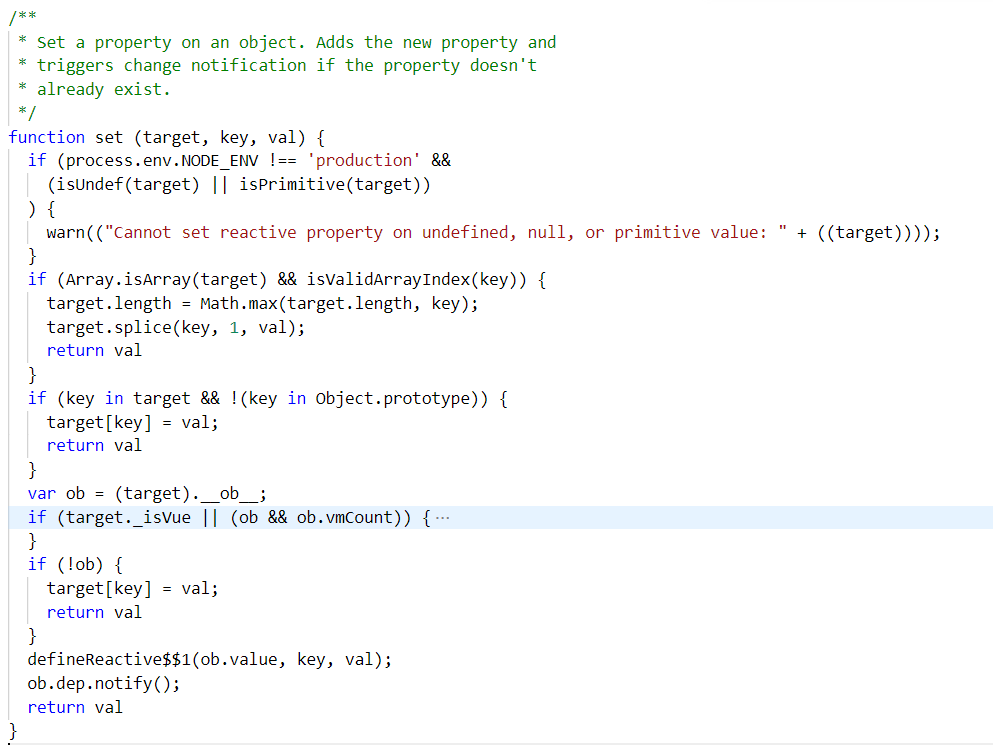
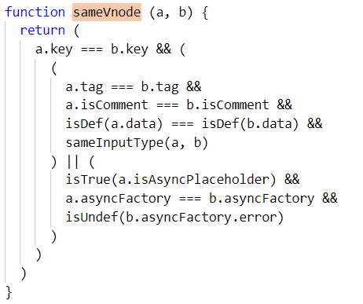
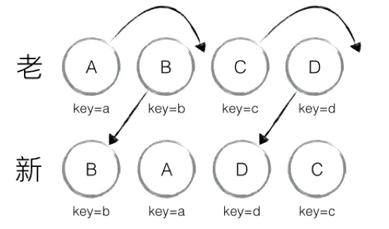
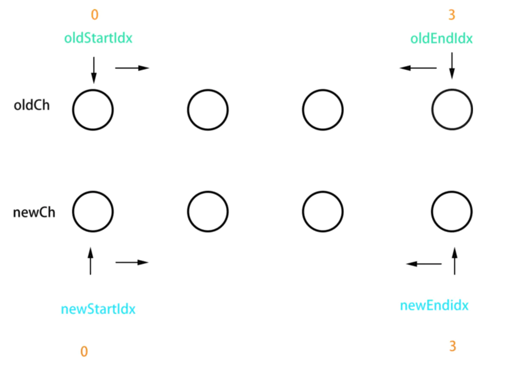

# [返回主页](https://github.com/evenMai92/front-end-interview/blob/master/README.md)
### [vue相关源码解析](https://ustbhuangyi.github.io/vue-analysis/)

<b><details><summary>1. Vue的实例和组件为什么data书写不一样</summary></b>
答案：

1. 如果两个实例引用同一个对象，当其中一个实例的属性发生改变时，另一个实例属性也随之改变，只有当两个实例拥有自己的作用域时，才不会相互干扰.

2. 组建中的data写成一个函数，数据以函数返回值的形式定义，这样每次复用组件的时候，都会返回一份新的data，相当于每个组件实例都有自己私有的数据空间，它们只负责各自维护的数据，不会造成混乱

[详解](https://axiu.me/coding/why-vue-component-data-must-be-function/)

公司：字节跳动
</details>

<b><details><summary>2. vue新增属性怎么变响应式，为什么?</summary></b>
答案：

1. 调用全局方法Vue.set(target, key, val)或者实例方法vm.$set(target, key, val)都可以将新增属性或者对数组下标设置成响应式；

2. 原理：对于数组，调用splice方法；对于对象调用defineReactive方法设置响应式，并触发一次更新；


3. vue3.0将数据劫持原理由defineProperty改为Proxy，优化对对象进行递归设置拦截，同时还能监听数组和新增属性变化，唯一不好，就是兼容性问题；

[详解](https://www.cnblogs.com/goloving/p/10986120.html)

公司：腾讯
</details>

<b><details><summary>3. Vue的列表渲染为什么加key，以index为key有什么问题?</summary></b>
答案：

1. diff算法默认使用“就地复用”的策略（用index作为key和不加key是一样的，都采用“就地复用”的策略）


2. “就地复用”的策略，只适用于不依赖子组件状态或临时 DOM 状态 (例如：表单输入值) 的列表渲染输出;

3. 将与元素唯一对应的值作为key，可以最大化利用dom节点，提升性能

[详解](https://www.cnblogs.com/youhong/p/11327062.html)

公司：字节跳动、腾讯
</details>

<b><details><summary>4. vue为什么用vdom，vdom一定会提升性能吗?</summary></b>
答案：

Vue 之所以引入了 Virtual DOM，更重要的原因是为了解耦 HTML 依赖，这带来两个非常重要的好处是：
1. 不再依赖 HTML 解析器进行模版解析，可以进行更多的 AOT 工作提高运行时效率：通过模版 AOT 编译，Vue 的运行时体积可以进一步压缩，运行时效率可以进一步提升；

2. 可以渲染到 DOM 以外的平台，实现 SSR、同构渲染这些高级特性，Weex 等框架应用的就是这一特性。

[尤大大回答](https://www.zhihu.com/question/31809713/answer/53544875)

公司：金蝶科技
</details>

<b><details><summary>5. vue3.0做了那些优化改进？</summary></b>
答案：

1. 更快
- 虚拟DOM重写
- 优化slots的生成
- 静态树提升
- 静态属性提升
- 基于Proxy的响应式系统

2. 更小：
- 通过摇树优化核心库体积

3. 更容易维护：
- TypeScript + 模块化

4. 更加友好
- 跨平台：编译器核心和运行时核心与平台无关，使得Vue更容易与任何平台（Web、Android、iOS）一起使用

5. 更容易使用
- 改进的TypeScript支持，编辑器能提供强有力的类型检查和错误及警告

[详解](https://juejin.im/post/5ea1c1cae51d4546ff700c80?utm_medium=hao.caibaojian.com&utm_source=hao.caibaojian.com)

公司：金蝶科技
</details>

<b><details><summary>6. vue父子组件的通讯方式有哪些？</summary></b>
答案：

1. props;
2. $emit;
3. 属性$attrs 和 $listeners;
4. provide / inject;
5. EventBus;
6. $parent;
7. Vuex;

[详解](https://juejin.im/post/5bd18c72e51d455e3f6e4334)

公司：金蝶科技、微众
</details>

<b><details><summary>7. vue非父子组件的通讯方式有哪些？</summary></b>
答案：

1. EventBus;
2. Vuex;

[详解](https://segmentfault.com/a/1190000008042320)

公司：腾讯
</details>

<b><details><summary>8. Vue.nextTick原理及使用场景？</summary></b>
答案：

* vue 是异步执行 dom 更新的，一旦观察到数据变化，Vue 就会开启一个队列，然后把在同一个事件循环 (event loop) 当中观察到数据变化的 watcher 推送进这个队列。
* 如果这个 watcher 被触发多次，只会被推送到队列一次。这种缓冲行为可以有效的去掉重复数据造成的不必要的计算和 DOM 操作。而在下一个事件循环时，Vue 会清空队列，并进行必要的 DOM 更新。 
* 当你设置 vm.someData = 'new value'，DOM 并不会马上更新，而是在异步队列被清除，也就是下一个事件循环开始执行更新时才会进行必要的 DOM 更新。如果此时你想要根据更新的 DOM 状态去做某些事情，就会出现问题。
* 为了在数据变化之后等待 Vue 完成更新 DOM ，可以在数据变化之后立即使用 Vue.nextTick(callback)

[详解](https://segmentfault.com/a/1190000013314893)

公司：虎牙、顺丰科技
</details>

<b><details><summary>9. vue-router原理，有几种模式，有什么区别？</summary></b>
答案：

1. hash模式：在浏览器中符号“#”，#以及#后面的字符称之为hash，用window.location.hash读取；
特点：hash虽然在URL中，但不被包括在HTTP请求中；用来指导浏览器动作，对服务端安全无用，hash不会重加载页面。
hash 模式下，仅 hash 符号之前的内容会被包含在请求中，如 http://www.xxx.com，因此对于后端来说，即使没有做到对路由的全覆盖，也不会返回 404 错误。

2. history模式：history采用HTML5的新特性；且提供了两个新方法：pushState（），replaceState（）可以对浏览器历史记录栈进行修改，以及popState事件的监听到状态变更。
history 模式下，前端的 URL 必须和实际向后端发起请求的 URL 一致，如 http://www.xxx.com/items/id。后端如果缺少对 /items/id 的路由处理，将返回 404 错误。

3. abstract模式：支持所有 JavaScript 运行环境，如 Node.js 服务器端；

[详解](https://juejin.im/post/5bc6eb875188255c9c755df2#heading-2)

公司：金蝶科技
</details>

<b><details><summary>10. vue响应式原理</summary></b>
答案：


[详解](https://zhuanlan.zhihu.com/p/88648401)

公司：金蝶科技、微众
</details>

<b><details><summary>11. vue怎么自定义指令？</summary></b>
答案：

[详解](https://cn.vuejs.org/v2/guide/custom-directive.html#ad)

公司：腾讯
</details>

<b><details><summary>12. vue中获取dom节点的方法有哪些？</summary></b>
答案：

1. ref属性

2. DOM API

[详解](https://www.jianshu.com/p/3aeaa3cc6114)

公司：腾讯
</details>

<b><details><summary>13. 怎么根据url后面参数变化(?xx=xx)，刷新当前页面数据？</summary></b>
答案：

1. 监听$route变化，并请求新的数据；

2. 进入组件路由钩子beforeRouteEnter或beforeRouteUpdate时，根据跳转参数的变化请求新的数据；

3. created生命周期后，可以通过this.$route取到query参数，并请求新的数据；

公司：腾讯
</details>

<b><details><summary>14. $route和$router的区别？</summary></b>
答案：

1. $route是一个跳转的路由对象，每一个路由都会有一个route对象，是一个局部的对象，可以获取对应的name,path,params,query等;

2. $router是VueRouter的一个对象，通过Vue.use(VueRouter)和VueRouter构造函数得到一个router的实例对象，这个对象中是一个全局的对象，他包含了所有的路由包含了许多关键的对象和属性;

[详解](https://segmentfault.com/a/1190000009392552)

公司：顺丰科技
</details>

<b><details><summary>15. keep-alive有啥作用，跟keep-alive有关的生命周期有哪些？</summary></b>
答案：

1. \<keep-alive\>是Vue的内置组件，能在组件切换过程中将状态保留在内存中，防止重复渲染DOM；

2. \<keep-alive\>组件激活时触发activated，被停用时触发deactivated；

[详解](https://www.cnblogs.com/goloving/p/9256212.html)

公司：顺丰科技
</details>

<b><details><summary>16. vue父子组件生命周期的执行顺序？</summary></b>
答案：

1. 加载渲染过程
* 父beforeCreate->父created->父beforeMount->子beforeCreate->子created->子beforeMount->子mounted->父mounted

2. 子组件更新过程
* 父beforeUpdate->子beforeUpdate->子updated->父updated

3. 父组件更新过程
* 父beforeUpdate->父updated

[详解](https://www.rokub.com/63657.html)

公司：腾讯
</details>

<b><details><summary>17. 比较react与vue？</summary></b>
答案：

1. 相同点
* 都有组件化开发和Virtual DOM
* 都支持props进行父子组件间数据通信
* 都支持数据驱动视图, 不直接操作真实DOM, 更新状态数据界面就自动更新
* 都支持服务器端渲染
* 都有支持native的方案,React的React Native,Vue的Weex

2. 不同点
* 数据绑定: vue实现了数据的双向绑定,react数据流动是单向的
* 组件写法不一样, React推荐的做法是 JSX , 也就是把HTML和CSS全都写进JavaScript了,即'all in js'; Vue推荐的做法是webpack+vue-loader的单文件组件格式,即html,css,js写在同一个文件
* state对象在react应用中不可变的,需要使用setState方法更新状态;在vue中,state对象不是必须的,数据由data属性在vue对象中管理
* virtual DOM不一样,vue会跟踪每一个组件的依赖关系,不需要重新渲染整个组件树.而对于React而言,每当应用的状态被改变时,全部组件都会重新渲染,所以react中会需要shouldComponentUpdate这个生命周期函数方法来进行控制
* React严格上只针对MVC的view层,Vue则是MVVM模式

[详解](https://www.cnblogs.com/yubin-/p/11537122.html)

公司：顺丰科技
</details>

<b><details><summary>18. react diff与vue diff的区别？</summary></b>
答案：
1. react diff过程



2. vue diff过程



[详解](https://www.jianshu.com/p/398e63dc1969)

公司：顺丰科技
</details>

<b><details><summary>19. vue组件懒加载有几种方式，区别是什么？</summary></b>
答案：

1. es6
```javascript
var A = () => import('./A');
```
2. commonjs
```javascript
var B = (resolve) => require(['./B'], resolve);
```
3. commonjs
```javascript
var C = ( resolve ) => {
  return require.ensure([], () => {
    resolve(require( './C' ))
  })
}
```
### 区别：
1. require是有webpack社区提供方案，import为es6官方提供；
2. 使用require方式可以将多个模块js组合分割打包，require下面方法ensure第一个参数是依赖，如果不需要请写[]（空数组）,而import只能将每个模块独立打包成一个js文件；也就是说，如果现在有三个导航A、B、C，你现在用require可以将A单独分割出来做懒加载，进入a模块只请求A，B和C你可以组合在一起进行分割，进入B和C将加载共同一个文件；
  例如：
```javascript
let Doc = (resolve) => {
  return require.ensure([], () => {
    resolve(require('@/views/backend/doc'))
  }, "abc")
}*//*
let Workbench = (resolve) => {
  return require.ensure([], () => {
    resolve(require('@/views/backend/workbench'))
  }, "abc")
}
```
3. 如上例子，最后一个参数'abc'名称就是进行匹配哪几个文件打包在一起加载

[详解](https://www.zhihu.com/question/20215561)

公司：顺丰科技
</details>

<b><details><summary>20. vuex原理及有哪些属性？</summary></b>
答案：

1. vuex 整体思想诞生于 flux,可其的实现方式完完全全的使用了 vue 自身的响应式设计，依赖监听、依赖收集都属于 vue 对对象 Property set get 方法的代理劫持。vuex 工作原理:vuex 中的 store 本质就是没有 template 的隐藏着的 vue 组件；

2. 解析：vuex的原理其实非常简单，它为什么能实现所有的组件共享同一份数据？ 因为vuex生成了一个store实例，并且把这个实例挂在了所有的组件上，所有的组件引用的都是同一个store实例。 store实例上有数据，有方法，方法改变的都是store实例上的数据。由于其他组件引用的是同样的实例，所以一个组件改变了store上的数据， 导致另一个组件上的数据也会改变，就像是一个对象的引用；

3. 属性state、action、mutation、module、getter

[详解](http://www.imooc.com/article/291242)

公司：顺丰科技
</details>

<b><details><summary>21. v-if和v-show的区别？</summary></b>
答案：

1. v-show本质就是标签display设置为none，控制隐藏

2. v-if是动态的向DOM树内添加或者删除DOM元素

[详解](https://cn.vuejs.org/v2/guide/conditional.html#v-if-vs-v-show)

公司：有赞
</details>

<b><details><summary>22. watch和computed区别？</summary></b>
答案：

* computed是计算值，具有缓存性，页面重新渲染值不变化,计算属性会立即返回之前的计算结果，而不必再次执行函数；
* computed不支持异步，当computed内有异步操作时无效，无法监听数据的变化；

* watch是观察的动作，无缓存性，数据变化后执行回调；
* watch支持异步；

[详解](https://ustbhuangyi.github.io/vue-analysis/v2/reactive/computed-watcher.html#computed)

公司：有赞
</details>

<b><details><summary>23. v-model的原理？</summary></b>
答案：

v-model本质上就是语法糖，即利用v-model绑定数据后，其实就是既绑定了数据，又添加了一个input事件监听

[详解](https://www.zhangjinglin.cn/blog/d34df6d79dfcdb9efae75e36d78b62b657.html)

公司：快手
</details>

<b><details><summary>24. proxy与defineProperty对比？</summary></b>
答案：

[详解](https://www.jianshu.com/p/860418f0785c)

公司：有赞
</details>

<b><details><summary>25. vue 父组件监听子组件生命周期？</summary></b>
答案：

1. 使用on和emit;
```javascript
// Parent.vue
<Child @mounted="doSomething"/>

// Child.vue
mounted() {
  this.$emit("mounted");
}
```
2. hook钩子函数;
```javascript
//  Parent.vue
<Child @hook:mounted="doSomething" ></Child>

doSomething() {
   console.log('父组件监听到 mounted 钩子函数 ...');
}
    
//  Child.vue
mounted(){
   console.log('子组件触发 mounted 钩子函数 ...');
}
```

[详解](https://www.cnblogs.com/mengfangui/p/12546866.html)

公司：有赞
</details>

<b><details><summary>26. vue怎么做页面权限控制？</summary></b>

答案：利用 vue-router 的 全局钩子beforeEach或组件钩子beforeRouteEnter，可以在跳转页面前判断用户的权限（利用权限菜单列表），是否能够进入此页面，如果不能则提示错误或重定向到上一个页面。

公司：顺丰科技
</details>

<b><details><summary>26. 作用域插槽的使用</summary></b>
答案：[详解](https://cn.vuejs.org/v2/guide/components-slots.html#%E4%BD%9C%E7%94%A8%E5%9F%9F%E6%8F%92%E6%A7%BD)

公司：腾讯
</details>

<b><details><summary>27. 对MVVM框架的理解</summary></b>
答案：[详解](https://blog.csdn.net/jia12216/article/details/55520426)

公司：顺丰科技
</details>

<b><details><summary>28. mixin主要用途</summary></b>
答案：[详解](https://www.cnblogs.com/zjw2004112/p/12513045.html)

公司：腾讯
</details>

<b><details><summary>29. mixin里面的生命周期与组件内的生命周期执行顺序？mixin里面的方法或数据与组件内的相同时，vue时怎么解决的？</summary></b>
答案：[详解](https://cn.vuejs.org/v2/guide/mixins.html)

公司：腾讯
</details>